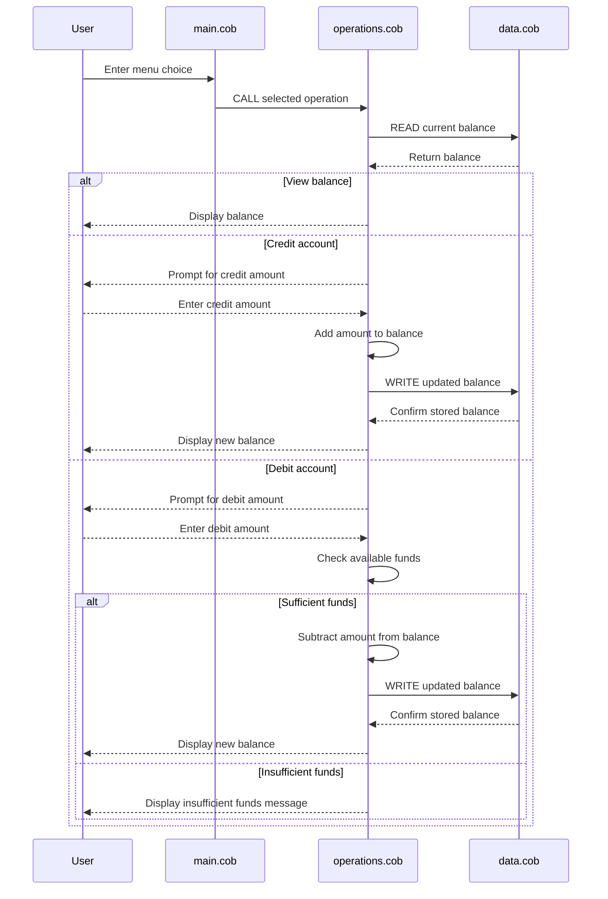

# COBOL Legacy Account Management Documentation

## Overview

This repository contains a small COBOL-based account management sample that models a student account balance workflow. The programs provide a menu-driven interface for viewing, crediting, and debiting an account balance, with simple persistence handled by a data helper program.

## File-by-file purpose

### `src/cobol/main.cob`

**Purpose:** Entry point for the interactive console application.

**Key functions:**
- Displays the main account management menu.
- Accepts user input for one of four actions:
  1. View balance
  2. Credit account
  3. Debit account
  4. Exit
- Dispatches the requested action to the `Operations` program.
- Loops until the user chooses to exit.

### `src/cobol/operations.cob`

**Purpose:** Implements the balance-changing business logic and orchestrates access to stored balance data.

**Key functions:**
- Receives an operation type through linkage (`TOTAL `, `CREDIT`, or `DEBIT `).
- Reads the current balance from `DataProgram`.
- For balance inquiry:
  - Calls `DataProgram` with `READ`.
  - Displays the current balance.
- For credit:
  - Prompts for a credit amount.
  - Reads the current balance.
  - Adds the credit amount.
  - Writes the updated balance back via `DataProgram`.
  - Displays the new balance.
- For debit:
  - Prompts for a debit amount.
  - Reads the current balance.
  - Checks whether funds are available.
  - If funds are sufficient, subtracts the amount, writes the updated balance, and displays the new balance.
  - If funds are insufficient, prints an "Insufficient funds" message.

### `src/cobol/data.cob`

**Purpose:** Stores and retrieves the account balance used by the other programs.

**Key functions:**
- Maintains an in-memory working-storage balance value initialized to `1000.00`.
- Supports two operations through the linkage section:
  - `READ`: returns the stored balance to the caller.
  - `WRITE`: updates the stored balance with the new value.

## Business rules for student accounts

- The sample starts with a default account balance of `1000.00`.
- Amounts are handled as numeric values with two decimal places.
- Credit operations increase the balance.
- Debit operations decrease the balance only when the current balance is greater than or equal to the requested amount.
- A debit request larger than the available balance is rejected and the balance remains unchanged.
- The application uses a simple menu-driven workflow intended for basic account balance management rather than full account persistence or auditing.

## Operational notes

- The programs are tightly coupled through COBOL `CALL` statements and linkage section data passing.
- There is no persistent database, file I/O, or multi-account support in this sample.
- The current implementation is suitable as a legacy modernization reference for introducing better structure, validation, and data handling.

## Data flow sequence diagram

